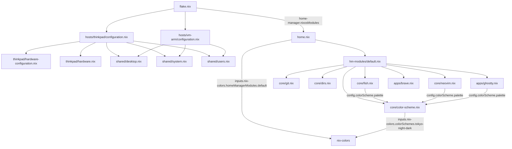

# Konfiguracja NixOS — kompletny przegląd

Ten dokument zawiera **całą konfigurację** repozytorium NixOS (flake + home-manager) w jednym pliku, wraz z **rozmieszczeniem** (strukturą katalogów) i opisem, jak poszczególne moduły są ze sobą powiązane.

---

## 1. Przegląd architektury

- **Flake** (`flake.nix`) definiuje dwie konfiguracje NixOS: `thinkpad` (x86_64-linux) i `vm-arm` (aarch64-linux).
- Konfiguracja **systemowa** (NixOS) znajduje się w katalogu `hosts/` — podzielona na:
  - `shared/` — wspólne moduły używane przez oba hosty,
  - `thinkpad/` — konfiguracja specyficzna dla laptopa (w tym sprzęt),
  - `vm-arm/` — konfiguracja dla maszyny wirtualnej ARM.
- Konfiguracja **użytkownika** (home-manager) znajduje się w `home.nix` oraz w modułach w `hm-modules/` (katalog `apps/` i `core/`).
- **home-manager** jest zarządzany przez NixOS (`home-manager.nixosModules.home-manager`), a użytkownik `kamil` korzysta z `./home.nix`.
- **Inputy flake**: `nixpkgs` (nixos-unstable), `home-manager` (master, follows nixpkgs), `nix-colors`.
- **Formatter**: `alejandra` (wsparcie dla `nix fmt`).

### Zależności między modułami



---

## 2. Rozmieszczenie plików (struktura katalogów)

```
nixos/
├── flake.nix                          # Wejście: definicje hostów, inputy, formatter
├── flake.lock                         # Zablokowane wersje inputów (wygenerowane)
├── home.nix                           # Konfiguracja home-manager dla użytkownika kamil
├── Makefile                           # Skróty: update, clean, news
├── hosts/                             # Konfiguracja systemowa NixOS
│   ├── shared/                        #   Moduły wspólne dla wszystkich hostów
│   │   ├── desktop.nix                #     Środowisko graficzne (GNOME, GDM, X11, dźwięk)
│   │   ├── system.nix                 #     Bootloader, kernel, sieć, GC, optymalizacja
│   │   └── users.nix                  #     Użytkownik kamil, pakiety systemowe, Steam
│   ├── thinkpad/                      #   Host: ThinkPad
│   │   ├── configuration.nix          #     Główny plik hosta (importy, hostname, stateVersion)
│   │   ├── hardware-configuration.nix #     Wygenerowany: dyski, moduły jądra, platforma
│   │   └── hardware.nix               #     Sprzęt: GPU Intel, zram, fprint, fstrim
│   └── vm-arm/                        #   Host: maszyna wirtualna ARM
│       └── configuration.nix          #     Główny plik hosta (importy, hostname, stateVersion)
└── hm-modules/                        # Moduły home-manager
    ├── default.nix                    #   Agregacja importów wszystkich modułów
    ├── apps/                          #   Aplikacje
    │   ├── brave.nix                  #     Przeglądarka Brave
    │   └── ghostty.nix                #     Terminal Ghostty (z paletą kolorów)
    └── core/                          #   Rdzeń środowiska użytkownika
        ├── color-scheme.nix           #     Motyw kolorów (nix-colors: tokyo-night-dark)
        ├── dirs.nix                   #     Katalogi użytkownika (xdg.userDirs, PL)
        ├── fish.nix                   #     Powłoka fish + zoxide + fzf
        ├── git.nix                    #     Konfiguracja git
        └── neovim.nix                 #     Edytor neovim (kolory z motywu)
```

---

## 3. Zawartość plików

### 3.1 `flake.nix`

```nix
{
  description = "NixOS configuration flake";

  inputs = {
    nixpkgs.url = "github:NixOS/nixpkgs/nixos-unstable";

    home-manager = {
      url = "github:nix-community/home-manager/master";
      inputs.nixpkgs.follows = "nixpkgs";
    };
    nix-colors.url = "github:misterio77/nix-colors";
  };

  outputs = {
    nixpkgs,
    home-manager,
    nix-colors,
    ...
  }@inputs: {
      formatter =
        nixpkgs.lib.genAttrs
        [
          "x86_64-linux"
          "aarch64-linux"
        ]
        (system: nixpkgs.legacyPackages.${system}.alejandra);

      nixosConfigurations = {
        thinkpad = nixpkgs.lib.nixosSystem {
          system = "x86_64-linux";
          specialArgs = {inherit inputs;};
          modules = [
            ./hosts/thinkpad/configuration.nix

            home-manager.nixosModules.home-manager
            {
              home-manager.useGlobalPkgs = true;
              home-manager.useUserPackages = true;
              home-manager.extraSpecialArgs = {inherit inputs;};
              home-manager.users.kamil = import ./home.nix;
            }
          ];
        };

        vm-arm = nixpkgs.lib.nixosSystem {
          system = "aarch64-linux";
          specialArgs = {inherit inputs;};
          modules = [
            ./hosts/vm-arm/configuration.nix

            home-manager.nixosModules.home-manager
            {
              home-manager.useGlobalPkgs = true;
              home-manager.useUserPackages = true;
              home-manager.extraSpecialArgs = {inherit inputs;};
              home-manager.users.kamil = import ./home.nix;
            }
          ];
        };
      };
    };
}
```

**Opis:**
- `nixpkgs` z gałęzi `nixos-unstable`.
- `home-manager` z `master`, z `nixpkgs.follows` (współdzieli nixpkgs).
- `nix-colors` — motywy kolorów.
- `formatter` ustawiony na `alejandra` dla `x86_64-linux` i `aarch64-linux`.
- Oba hosty (`thinkpad`, `vm-arm`) korzystają z tego samego `home.nix` i przekazują `inputs` przez `specialArgs` / `extraSpecialArgs`.

---

### 3.2 `home.nix`

```nix
{
  pkgs,
  inputs,
  ...
}: {
  imports = [
    inputs.nix-colors.homeManagerModules.default
    ./hm-modules
  ];

  home = {
    username = "kamil";
    homeDirectory = "/home/kamil";
    stateVersion = "26.05";

    packages = with pkgs; [
      # Przeglądarka i Komunikacja
      discord

      # Multimedia i Grafika
      darktable
      spotify

      # Gry i Narzędzia
      lutris
      prismlauncher
      qbittorrent

      # Narzędzia CLI
      fastfetch
      android-tools

      # Edytory kodu i IDE
      vscode

      # Czcionki
      nerd-fonts.jetbrains-mono
    ];
  };
}
```

**Opis:**
- Importuje moduł nix-colors dla home-manager oraz cały katalog `hm-modules/` (agregowany przez `hm-modules/default.nix`).
- Użytkownik: `kamil`, katalog domowy `/home/kamil`, `stateVersion = "26.05"`.
- Pakiety: Discord, Darktable, Spotify, Lutris, Prism Launcher, qBittorrent, Fastfetch, android-tools, VS Code, JetBrains Mono Nerd Font.

---

### 3.3 `Makefile`

```makefile
.PHONY: update clean news

update:
	sudo nixos-rebuild switch --flake .#thinkpad

clean:
	nix-collect-garbage -d

news:
	home-manager news --flake .
```

**Opis:**
- `make update` — przebudowa systemu ThinkPad,
- `make clean` — czyszczenie śmieci w store Nixa,
- `make news` — informacje o zmianach w home-manager.

---

### 3.4 `hosts/thinkpad/configuration.nix`

```nix
{...}: {
  imports = [
    ./hardware-configuration.nix
    ../shared/desktop.nix
    ../shared/system.nix
    ../shared/users.nix
    ./hardware.nix
  ];

  networking.hostName = "thinkpad";

  nix.settings.experimental-features = ["nix-command" "flakes"];
  system.stateVersion = "26.05";
}
```

**Opis:**
- Główny plik hosta `thinkpad`.
- Importuje wygenerowaną konfigurację sprzętu, moduły wspólne oraz własny `hardware.nix`.
- Włącza eksperymentalne funkcje Nix (`nix-command`, `flakes`).

---

### 3.5 `hosts/thinkpad/hardware-configuration.nix`

```nix
{ config, lib, modulesPath, ... }:

{
  imports =
    [ (modulesPath + "/installer/scan/not-detected.nix")
    ];

  boot.initrd.availableKernelModules = [ "xhci_pci" "nvme" "usb_storage" "sd_mod" "rtsx_pci_sdmmc" ];
  boot.initrd.kernelModules = [ ];
  boot.kernelModules = [ "kvm-intel" ];
  boot.extraModulePackages = [ ];

  fileSystems."/" =
    { device = "/dev/disk/by-uuid/deca6886-1e4c-4dbc-9af0-ddcff085e46c";
      fsType = "btrfs";
    };

  fileSystems."/home" =
    { device = "/dev/disk/by-uuid/deca6886-1e4c-4dbc-9af0-ddcff085e46c";
      fsType = "btrfs";
      options = [ "subvol=home" ];
    };

  fileSystems."/nix" =
    { device = "/dev/disk/by-uuid/deca6886-1e4c-4dbc-9af0-ddcff085e46c";
      fsType = "btrfs";
      options = [ "subvol=nix" ];
    };

  fileSystems."/boot" =
    { device = "/dev/disk/by-uuid/F844-AD21";
      fsType = "vfat";
      options = [ "fmask=0077" "dmask=0077" ];
    };

  swapDevices = [ ];

  nixpkgs.hostPlatform = lib.mkDefault "x86_64-linux";
  hardware.cpu.intel.updateMicrocode = lib.mkDefault config.hardware.enableRedistributableFirmware;
}
```

**Opis:**
- Wygenerowany plik (`nixos-generate-config`).
- System plików **btrfs** z subwoluminami `/home` i `/nix` na jednej partycji + `/boot` (vfat/EFI).
- Brak swapu (swap odbywa się przez `zramSwap` w `hardware.nix`).
- Moduły jądra dla Intel (w tym `kvm-intel`).
- Automatyczna aktualizacja mikrokodu CPU Intel.

---

### 3.6 `hosts/thinkpad/hardware.nix`

```nix
{pkgs, ...}: {
  # Hardware & Wydajność
  hardware.graphics = {
    enable = true;
    extraPackages = with pkgs; [
      intel-media-driver # VA-API → sprzętowe kodowanie wideo
      intel-vaapi-driver # backup VA-API
      intel-compute-runtime-legacy1 # OpenCL/Level Zero dla Darktable
    ];
    extraPackages32 = with pkgs; [
      intel-media-driver
      intel-compute-runtime-legacy1
    ];
  };
  zramSwap.enable = true;
  services.fprintd.enable = true;
  services.fprintd.tod.enable = true;
  services.fprintd.tod.driver = pkgs.libfprint-2-tod1-goodix;

  services.fstrim.enable = true;
}
```

**Opis:**
- Sprzętowe kodowanie wideo **VA-API** (Intel) + OpenCL dla Darktable.
- **zramSwap** — swap w RAM (stąd brak swapDevices).
- **fprintd** z driverem Goodix (czytnik linii papilarnych).
- **fstrim** — TRIM dla dysków SSD.

---

### 3.7 `hosts/shared/desktop.nix`

```nix
{...}: {
  # Set your time zone.
  time.timeZone = "Europe/Warsaw";

  # Select internationalisation properties.
  i18n.defaultLocale = "pl_PL.UTF-8";

  i18n.extraLocaleSettings = {
    LC_ADDRESS = "pl_PL.UTF-8";
    LC_IDENTIFICATION = "pl_PL.UTF-8";
    LC_MEASUREMENT = "pl_PL.UTF-8";
    LC_MONETARY = "pl_PL.UTF-8";
    LC_NAME = "pl_PL.UTF-8";
    LC_NUMERIC = "pl_PL.UTF-8";
    LC_PAPER = "pl_PL.UTF-8";
    LC_TELEPHONE = "pl_PL.UTF-8";
    LC_TIME = "pl_PL.UTF-8";
  };

  # Enable the X11 windowing system.
  services.xserver.enable = true;

  # Enable the GNOME Desktop Environment.
  services.desktopManager.gnome.enable = true;
  services.displayManager.gdm.enable = true;

  # Configure keymap in X11
  services.xserver.xkb = {
    layout = "pl";
    variant = "";
  };

  # Configure console keymap
  console.keyMap = "pl2";

  # Enable CUPS to print documents.
  services.printing.enable = true;

  # Enable sound with pipewire.
  services.pipewire = {
    enable = true;
    alsa.enable = true;
    alsa.support32Bit = true;
    pulse.enable = true;
  };
}
```

**Opis:**
- Strefa czasowa `Europe/Warsaw`, locale `pl_PL.UTF-8` (wszystkie kategorie LC).
- **GNOME** + **GDM** na X11, układ klawiatury `pl`, konsola `pl2`.
- **CUPS** (drukowanie) oraz **PipeWire** (dźwięk z ALSA + PulseAudio).

---

### 3.8 `hosts/shared/system.nix`

```nix
{pkgs, ...}: {
  # Bootloader.
  boot.loader.systemd-boot.enable = true;
  boot.loader.efi.canTouchEfiVariables = true;

  # Use latest kernel.
  boot.kernelPackages = pkgs.linuxPackages_latest;

  # Enable networking
  networking.networkmanager.enable = true;

  # Enable fish shell system-wide (required for users.users.kamil.shell)
  programs.fish.enable = true;

  # Limit the number of generations to keep
  boot.loader.systemd-boot.configurationLimit = 4;

  # Perform garbage collection weekly to maintain low disk usage
  nix.gc = {
    automatic = true;
    dates = "weekly";
    options = "--delete-older-than 7d";
  };

  # Optimize storage
  nix.settings.auto-optimise-store = true;
}
```

**Opis:**
- Bootloader **systemd-boot** (EFI), limit 4 generacji.
- Najnowsze jądro Linuxa (`linuxPackages_latest`).
- **NetworkManager** do sieci.
- **fish** jako powłoka systemowa (wymagane dla `users.users.kamil.shell`).
- Automatyczny **GC** (co tydzień, usuwa generacje starsze niż 7 dni) i optymalizacja store.

---

### 3.9 `hosts/shared/users.nix`

```nix
{pkgs, ...}: {
  # Define a user account.
  users.users."kamil" = {
    isNormalUser = true;
    description = "Kamil";
    shell = pkgs.fish;
    extraGroups = ["networkmanager" "wheel" "adbusers"];
  };

  environment.gnome.excludePackages = with pkgs; [
    gnome-tour
    epiphany
    gnome-contacts
    gnome-weather
    gnome-maps
    gnome-characters
    gnome-connections
    gnome-font-viewer
    yelp
    snapshot
    gnome-music
    gnome-console
  ];

  services.xserver.excludePackages = [pkgs.xterm];

  # Allow unfree packages
  nixpkgs.config.allowUnfree = true;

  programs.steam.enable = true;

  environment.systemPackages = with pkgs; [
    # Narzędzia podstawowe / Budowanie
    curl
    wget
    gnumake

    # Formatowanie i Language Server dla Nixa
    alejandra
    nixd

    # Rozszerzenia GNOME
    gnomeExtensions.blur-my-shell
    gnomeExtensions.clipboard-indicator
  ];
}
```

**Opis:**
- Użytkownik `kamil`: normalny, powłoka fish, grupy `networkmanager`, `wheel`, `adbusers`.
- Usunięte domyślne aplikacje GNOME (Epiphany, Kontakty, Pogoda, Mapy, Music, Yelp, Snapshot itd.).
- `allowUnfree = true`, **Steam** włączony.
- Pakiety systemowe: curl, wget, gnumake, alejandra, nixd, rozszerzenia GNOME (blur-my-shell, clipboard-indicator).

---

### 3.10 `hosts/vm-arm/configuration.nix`

```nix
{...}: {
  imports = [
    ../shared/desktop.nix
    ../shared/system.nix
    ../shared/users.nix
  ];

  networking.hostName = "vm-arm";

  nix.settings.experimental-features = ["nix-command" "flakes"];
  system.stateVersion = "uzupełnij";
}
```

**Opis:**
- Host `vm-arm` — maszyna wirtualna **aarch64-linux**.
- Korzysta wyłącznie z modułów wspólnych (`shared/`), bez własnej konfiguracji sprzętu.
- ⚠️ `system.stateVersion = "uzupełnij"` — **placeholder do uzupełnienia** (np. `"26.05"`); w obecnej formie przebudowa zakończy się błędem.

---

### 3.11 `hm-modules/default.nix`

```nix
{...}: {
  imports = [
    ./core/fish.nix
    ./core/git.nix
    ./core/dirs.nix
    ./core/neovim.nix
    ./core/color-scheme.nix

    ./apps/ghostty.nix
    ./apps/brave.nix
  ];
}
```

**Opis:**
- Agregator wszystkich modułów home-manager — importowany jako `./hm-modules` z `home.nix`.

---

### 3.12 `hm-modules/core/color-scheme.nix`

```nix
{inputs, ...}: {
  colorScheme = inputs.nix-colors.colorSchemes.tokyo-night-dark;
}
```

**Opis:**
- Ustawia motyw kolorów **Tokyo Night Dark** z nix-colors.
- Wymaga `inputs` przekazanego przez `extraSpecialArgs` w `flake.nix`.
- Paleta (`.palette.*`) jest konsumowana przez `fish.nix`, `neovim.nix` i `ghostty.nix`.

---

### 3.13 `hm-modules/core/fish.nix`

```nix
{config, pkgs, ... }: {
  programs.fish = {
    enable = true;
    interactiveShellInit = ''
      set fish_greeting
      set fish_color_command "#${config.colorScheme.palette.base0D}"
      set fish_color_error "#${config.colorScheme.palette.base08}"
      set fish_color_param "#${config.colorScheme.palette.base0A}"
      set fish_color_quote "#${config.colorScheme.palette.base0B}"
      set fish_color_operator "#${config.colorScheme.palette.base0E}"
      set fish_color_autosuggestion "#${config.colorScheme.palette.base03}"
      set fish_color_selection "--background=#${config.colorScheme.palette.base04}"
      set fish_color_search_match "--background=#${config.colorScheme.palette.base04}"
    '';

    plugins = [
      {
        name = "hydro";
        src = pkgs.fishPlugins.hydro.src;
      }
    ];
  };

  programs.zoxide = {
    enable = true;
    enableFishIntegration = true;
  };

  programs.fzf = {
    enable = true;
    enableFishIntegration = true;
  };
}
```

**Opis:**
- Powłoka **fish** z koloryzacją z palety motywu (Tokyo Night), plugin **hydro** (prompt).
- **zoxide** (smarter `cd`) i **fzf** (fuzzy finder) z integracją fish.

---

### 3.14 `hm-modules/core/git.nix`

```nix
{...}: {
  programs.git = {
    enable = true;
    settings.user.name = "kaczub";
    settings.user.email = "170130290+kaczub@users.noreply.github.com";
  };
}
```

**Opis:**
- Konfiguracja **git**: nazwa `kaczub`, e-mail GitHub (noreply).

---

### 3.15 `hm-modules/core/dirs.nix`

```nix
{config, ...}: {
  xdg.userDirs = {
    enable = true;
    createDirectories = true;

    download = "${config.home.homeDirectory}/Pobrane";
    documents = "${config.home.homeDirectory}/Dokumenty";
    pictures = "${config.home.homeDirectory}/Obrazy";
    videos = "${config.home.homeDirectory}/Filmy";
    music = "${config.home.homeDirectory}/Muzyka";
    templates = null;
    publicShare = null;
  };

  xdg.configFile."user-dirs.dirs".force = true;
}
```

**Opis:**
- Katalogi użytkownika zgodne z polskimi nazwami (Pobrane, Dokumenty, Obrazy, Filmy, Muzyka).
- `templates` i `publicShare` wyłączone; wymuszenie zapisu `user-dirs.dirs`.

---

### 3.16 `hm-modules/core/neovim.nix`

```nix
{config, ...}: {
  programs.neovim = {
    enable = true;

    extraConfig = ''
      set background=dark
      highlight Normal guibg=#${config.colorScheme.palette.base00} guifg=#${config.colorScheme.palette.base05}
      highlight NormalNC guibg=#${config.colorScheme.palette.base01}
      highlight Comment guifg=#${config.colorScheme.palette.base03}
      highlight String guifg=#${config.colorScheme.palette.base0B}
      highlight Function guifg=#${config.colorScheme.palette.base0D}
      highlight Keyword guifg=#${config.colorScheme.palette.base0E}
      highlight Type guifg=#${config.colorScheme.palette.base0A}
      highlight Number guifg=#${config.colorScheme.palette.base09}
      highlight LineNr guifg=#${config.colorScheme.palette.base03}
      highlight CursorLineNr guifg=#${config.colorScheme.palette.base0D}
      highlight Visual guibg=#${config.colorScheme.palette.base04}
      highlight StatusLine guibg=#${config.colorScheme.palette.base01} guifg=#${config.colorScheme.palette.base05}
      highlight Pmenu guibg=#${config.colorScheme.palette.base01} guifg=#${config.colorScheme.palette.base05}
    '';
  };
}
```

**Opis:**
- **Neovim** z ręcznie ustawionymi highlightami (kolory pobierane z palety motywu).
- Wymaga parametru `{config, ...}` — bez niego `config` byłby niezdefiniowany.

---

### 3.17 `hm-modules/apps/ghostty.nix`

```nix
{config, ...}: {
  programs.ghostty = {
    enable = true;
    enableFishIntegration = true;

    settings = {
      font-family = "JetBrainsMono Nerd Font";
      font-size = 12;

      background = "#${config.colorScheme.palette.base00}";
      foreground = "#${config.colorScheme.palette.base05}";
      cursor-color = "#${config.colorScheme.palette.base0D}";
      selection-background = "#${config.colorScheme.palette.base02}";

      palette = [
        "0=#${config.colorScheme.palette.base00}"
        "1=#${config.colorScheme.palette.base08}"
        "2=#${config.colorScheme.palette.base0B}"
        "3=#${config.colorScheme.palette.base0A}"
        "4=#${config.colorScheme.palette.base0D}"
        "5=#${config.colorScheme.palette.base0E}"
        "6=#${config.colorScheme.palette.base0C}"
        "7=#${config.colorScheme.palette.base05}"
        "8=#${config.colorScheme.palette.base03}"
        "9=#${config.colorScheme.palette.base08}"
        "10=#${config.colorScheme.palette.base0B}"
        "11=#${config.colorScheme.palette.base0A}"
        "12=#${config.colorScheme.palette.base0D}"
        "13=#${config.colorScheme.palette.base0E}"
        "14=#${config.colorScheme.palette.base0C}"
        "15=#${config.colorScheme.palette.base07}"
      ];
    };
  };
}
```

**Opis:**
- Terminal **Ghostty** z integracją fish.
- Czcionka JetBrainsMono Nerd Font, rozmiar `12` (liczba, nie string).
- Kolory tła, tekstu, kursora i pełna 16-kolorowa paleta z motywu Tokyo Night.

---

### 3.18 `hm-modules/apps/brave.nix`

```nix
{...}: {
  programs.brave.enable = true;
}
```

**Opis:**
- Włącza przeglądarkę **Brave**.

---

## 4. Uwagi i znane problemy

> Na podstawie wcześniejszego przeglądu repozytorium (notatki w `/memories/repo/nixos-review.md`).

- ⚠️ **`hosts/vm-arm/configuration.nix`**: `system.stateVersion = "uzupełnij"` — placeholder do uzupełnienia; przebudowa `vm-arm` zakończy się błędem.
- ⚠️ **`hosts/thinkpad/hardware.nix`**: `libfprint-2-tod1-goodix` został usunięty z nixpkgs — rozważ `libfprint-2-tod1-goodix-oss`.
- ⚠️ **`hosts/thinkpad/hardware.nix`**: `intel-compute-runtime-legacy1` w `extraPackages32` może nie istnieć dla 32-bitów.
- ⚠️ **Brak `inputs` w funkcjach modułów**, które go używają, powoduje błąd — dotyczy to m.in. modułów odwołujących się do `config.colorScheme.palette.*` (muszą mieć sygnaturę `{config, ...}:`).

## 5. Komendy

| Komenda | Opis |
|---|---|
| `make update` | Przebudowa systemu ThinkPad (`sudo nixos-rebuild switch --flake .#thinkpad`) |
| `make clean` | Czyszczenie śmieci (`nix-collect-garbage -d`) |
| `make news` | Informacje home-manager (`home-manager news --flake .`) |
| `nix fmt` | Formatowanie całego repo formatterem (alejandra) |
